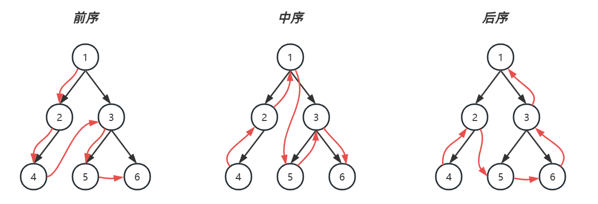

# Binary Tree

A binary tree is a tree-like structure where each node can have at most two children, referred to as the left child and the right child.

Key Types of Binary Tree Structures
**Complete Binary Tree:**
This is a type of binary tree where every level, except the last, is fully filled.
When filling the nodes, the tree is populated from left to right.

**Balanced Binary Tree:**
This is a type of binary tree where the height difference between the left and right subtrees of any node is no more than one.
Binary Tree Traversal Methods

**Binary tree traversal can be categorized into two main types:**

**1. Breadth-First Traversal (Level Order):**
This traversal visits nodes level by level, starting from the root and moving to nodes that are closest to the root.
Depth-First Traversal:
This type of traversal explores as far down a branch as possible before backtracking. In binary trees, depth-first traversal can be further divided into three types:

**2. Pre-order Traversal:**
Visit the current node first, then recursively visit the left subtree, followed by the right subtree.

3. In-order Traversal:
Recursively visit the left subtree first, then the current node, and finally the right subtree.

4. Post-order Traversal:
Recursively visit the left subtree first, followed by the right subtree, and visit the current node last.
## Template for BFS
```java
public List<List<Integer>> bfs(TreeNode root) {
    List<List<Integer>> result = new ArrayList<>();
    if (root == null) {
        return result;
    }

    Queue<TreeNode> queue = new LinkedList<>();
    queue.offer(root);

    while (!queue.isEmpty()) {
        int levelSize = queue.size(); // Number of nodes at the current level
        List<Integer> currentLevel = new ArrayList<>();

        for (int i = 0; i < levelSize; i++) {
            TreeNode currentNode = queue.poll();
            currentLevel.add(currentNode.val);

            // Add the left and right children of the current node to the queue
            if (currentNode.left != null) {
                queue.offer(currentNode.left);
            }
            if (currentNode.right != null) {
                queue.offer(currentNode.right);
            }
        }

        // Add the current level to the result
        result.add(currentLevel);
    }

    return result;
}
```

## Template for DFS

### With Recursion

```java
/**
 * <h3>Pre-Order</h3>
 */
static void preOrder(TreeNode node) {
    if (node == null) {
        return;
    }
    System.out.print(node.val + "\t"); // 值
    preOrder(node.left); // 左
    preOrder(node.right); // 右
}

/**
 * <h3>In-Order</h3>
 */
static void inOrder(TreeNode node) {
    if (node == null) {
        return;
    }
    inOrder(node.left); // 左
    System.out.print(node.val + "\t"); // 值
    inOrder(node.right); // 右
}

/**
 * <h3>Post-Order</h3>
 */
static void postOrder(TreeNode node) {
    if (node == null) {
        return;
    }
    postOrder(node.left); // 左
    postOrder(node.right); // 右
    System.out.print(node.val + "\t"); // 值
}
```

### Iterative approach
**Preorder**

```java
LinkedListStack<TreeNode> stack = new LinkedListStack<>();
TreeNode curr = root;

while (!stack.isEmpty() || curr != null) {
    if (curr != null) {
        stack.push(curr);
        System.out.println(curr);
        curr = curr.left;
    } else {
        TreeNode pop = stack.pop();
        curr = pop.right;
    }

}
```

**Inorder**

```java
LinkedListStack<TreeNode> stack = new LinkedListStack<>();
TreeNode curr = root;

while (!stack.isEmpty() || curr != null) {
    if (curr != null) {
        stack.push(curr);
        curr = curr.left;
    } else {
        TreeNode pop = stack.pop();
        System.out.println(pop);
        curr = pop.right;
    }
}
```

**Postorder**

```java
LinkedListStack<TreeNode> stack = new LinkedListStack<>();
TreeNode curr = root;
TreeNode pop = null;

while (!stack.isEmpty() || curr != null) {
    if (curr != null) {
        stack.push(curr);
        curr = curr.left;
    } else {
        TreeNode peek = stack.peek();
        if (peek.right == null || peek.right == pop) {
            pop = stack.pop();
            System.out.println(pop);
        } else {
            curr = peek.right;
        }
    }
}
```

对于后序遍历，向回走时，需要处理完右子树才能 pop 出栈。如何知道右子树处理完成呢？

* 如果栈顶元素的 $right \equiv null$ 表示没啥可处理的，可以出栈

* 如果栈顶元素的 $right \neq null$，

  * 那么使用 lastPop 记录最近出栈的节点，即表示从这个节点向回走
  * 如果栈顶元素的 $right==lastPop$ 此时应当出栈


对于前、中两种遍历，实际以上代码从右子树向回走时，并未走完全程（stack 提前出栈了）后序遍历以上代码是走完全程了


Let's see the templates in action, starting with some easy BFS ones:
## BFS problems:
### 1. Binary Tree Level Order Traversal
https://leetcode.com/problems/binary-tree-level-order-traversal/description/

> Similar question: Binary Tree Level Order Traversal II, the only difference is now we need
to add to the result list from leaf nodes upward to root:
https://leetcode.com/problems/binary-tree-level-order-traversal-ii/description/

```java
class Solution {
    public List<List<Integer>> levelOrder(TreeNode root) {
        List<List<Integer>> res = new ArrayList<>();
        if(root == null) {
            return res;
        }
        Queue<TreeNode> queue = new LinkedList<>();
        queue.offer(root);

        while(!queue.isEmpty()) {
            List<Integer> level = new ArrayList<>();
            int size = queue.size();

            for(int i = 0; i < size; i++) {
                TreeNode node = queue.poll();

                if(node.left != null) {
                    queue.offer(node.left);
                }
                if(node.right != null) {
                    queue.offer(node.right);
                }
                level.add(node.val);
            }
            res.add(level);
        }

        return res;
    }
}
```

### 2. Binary Tree Zigzag Level Order Traversal
https://leetcode.com/problems/binary-tree-zigzag-level-order-traversal/description/
```java 
class Solution {
    public List<List<Integer>> zigzagLevelOrder(TreeNode root) {
        List<List<Integer>> res = new ArrayList<>();
        if(root == null) {
            return res;
        }
        Queue<TreeNode> queue = new LinkedList<>();
        queue.offer(root);
        boolean isLeft = true;

        while(!queue.isEmpty()) {
            int size = queue.size();
            List<Integer> level = new ArrayList<>();

            for(int i = 0; i < size; i++) {
                TreeNode poll = queue.poll();

                if(poll.left != null) {
                    queue.offer(poll.left);
                }
                if(poll.right != null) {
                    queue.offer(poll.right);
                }

                if(isLeft) {
                    level.addLast(poll.val);
                } else {
                    level.addFirst(poll.val);
                }
            }

            isLeft = !isLeft;
            res.add(level);
        }

        return res;
    }
}
```

### Maximum Depth of Binary Tree
https://leetcode.com/problems/maximum-depth-of-binary-tree/description/

```java
class Solution {
    public int maxDepth(TreeNode root) {
        int res = 0;
        Queue<TreeNode> queue = new LinkedList<>();
        queue.offer(root);
        if(root == null) return res;

        while(!queue.isEmpty()) {
            int size = queue.size();

            for(int i = 0; i < size; i++) {
                TreeNode poll = queue.poll();
                if(poll.left != null) {
                    queue.offer(poll.left);
                }
                if(poll.right != null) {
                    queue.offer(poll.right);
                }
            }
            res++;
        }

        return res;
    }
}
```

### Minimum Depth of Binary Tree
https://leetcode.com/problems/minimum-depth-of-binary-tree/description/

```java
class Solution {
    public int minDepth(TreeNode root) {
        if(root == null) {
            return 0;
        }
        Queue<TreeNode> queue = new LinkedList<>();
        queue.offer(root);
        int res = 1;

        while(!queue.isEmpty()) {
            int size = queue.size();

            for(int i = 0; i < size; i++) {
                TreeNode poll = queue.poll();

                if(poll.left == null && poll.right == null) {
                    return res;
                }
                if(poll.left != null) {
                    queue.offer(poll.left);
                }
                if(poll.right != null) {
                    queue.offer(poll.right);
                }
            }

            res++;
        }

        return res;
    }
}
```

## DFS problems
### 3. Binary Tree Preorder Traversal
https://leetcode.com/problems/binary-tree-preorder-traversal/description/

**Recursion**
```java
class Solution {
    List<Integer> res = new ArrayList<>();
    public List<Integer> preorderTraversal(TreeNode root) {
        helper(root);
        return res;
    }

    void helper(TreeNode node) {
        if(node == null) {
            return;
        }
        res.add(node.val);
        helper(node.left);
        helper(node.right);
    }
}
```

**Iterative**
```java
class Solution {
    public List<Integer> preorderTraversal(TreeNode root) {
        Stack<TreeNode> stack = new Stack<>();
        List<Integer> res = new ArrayList<>();
        TreeNode curr = root;

        while(curr != null || !stack.isEmpty()) {
            if(curr != null) {
                stack.push(curr);
                res.add(curr.val);
                curr = curr.left;
            } else {
                TreeNode pop = stack.pop();
                curr = pop.right;
            }
        }

        return res;
    }
}
```

### 4. Symmetric Tree
https://leetcode.com/problems/symmetric-tree/description/

```java
class Solution {
    public boolean isSymmetric(TreeNode root) {
        return helper(root.left, root.right);
    }

    boolean helper(TreeNode left, TreeNode right) {
        if(left == null && right == null) {
            return true;
        }
        if(left == null || right == null) {
            return false;
        }
        if(left.val != right.val) {
            return false;
        }
        return helper(left.left, right.right) && helper(left.right, right.left);
    }
}
```


### 5. Maximum Depth of Binary Tree
https://leetcode.com/problems/maximum-depth-of-binary-tree/description/
```java

```

### Invert Binary Tree
https://leetcode.com/problems/invert-binary-tree/description/
```java
class Solution {
    public TreeNode invertTree(TreeNode root) {
        if(root == null) return null; 
        helper(root);
        return root;
    }
    
    // Why not define helper as helper(TreeNode left, TreeNode right) ?
    // Because we are inverting the two children of each node,
    // not inverting the entire tree symmetically
    void helper(TreeNode node) {
        if(node == null) return;
        TreeNode temp = node.left;
        node.left = node.right;
        node.right = temp;
        helper(node.left);
        helper(node.right); 
    }
}
```

###  Construct Binary Tree from Inorder and Postorder Traversal
https://leetcode.com/problems/construct-binary-tree-from-inorder-and-postorder-traversal/description/
```java
class Solution {
    // This map stores the mapping of nodes' values and their index in order
    Map<Integer, Integer> map = new HashMap<>();
    int[] post;
    int index;
    public TreeNode buildTree(int[] inorder, int[] postorder) {
        post = postorder;
        index = post.length-1;
        for(int i = 0; i < inorder.length; i++) {
            map.put(inorder[i], i);
        }
        return build(0, inorder.length-1);
    }

    TreeNode build(int left, int right) {
        // at some point in the recursion, we will get this illegal range, 
        // This is where we stop the recursion
        if(left > right) {
            return null;
        }

        // we find the root from the last element of postorder
        int val = post[index--];
        // get root index from inorder, so that we know what left and right branches are
        int rootIndex = map.get(val);
        TreeNode root = new TreeNode(val);
        // build right branch from right side of inorder
        // Note that we need to build right first, because we are decrementing index from end to start
        // and postorder's end to start represents a tree's right side
        root.right = build(rootIndex+1, right);
        // build left branch from left side of inorder
        root.left = build(left, rootIndex-1);
        return root;
    }
}
```

### Construct Binary Tree from Preorder and Inorder Traversal
https://leetcode.com/problems/construct-binary-tree-from-preorder-and-inorder-traversal/description/
```java
class Solution {
    Map<Integer, Integer> map = new HashMap<>();
    int[] pre;
    int index = 0;
    public TreeNode buildTree(int[] preorder, int[] inorder) {
        pre = preorder;
        for(int i = 0; i < inorder.length; i++) {
            map.put(inorder[i], i);
        }
        return build(0, inorder.length-1);
    }

    TreeNode build(int left, int right) {
        if(left > right) {
            return null;
        }

        int val = pre[index++];
        int rootIndex = map.get(val);
        TreeNode root = new TreeNode(val);
        root.left = build(left, rootIndex-1);
        root.right = build(rootIndex+1, right);
        return root;
    }
}
```
        if(map.getOrDefault(sum - target, 0) != 0) {
            System.out.println("sum: " + sum + ", target: " + target);
            System.out.println("node: " + node.val);
        }
## Backtracking-ish DFS

### Binary Tree Paths
https://leetcode.com/problems/binary-tree-paths/description/
```java
class Solution {
    List<String> res = new ArrayList<>();
    public List<String> binaryTreePaths(TreeNode root) {
        dfs(root, new ArrayList());
        return res;
    }

    void dfs(TreeNode node, List<String> list) {
        if(node == null) return;
        list.add(String.valueOf(node.val));
        if(node.left == null && node.right == null) {
            res.add(String.join("->", list));
        } else {
            dfs(node.left, list);
            dfs(node.right, list);
        }
        list.remove(list.size()-1);
    }
}
```

### Path Sum
https://leetcode.com/problems/path-sum/description/
```java
class Solution {
    public boolean hasPathSum(TreeNode root, int targetSum) {
        if(root == null) {
            return false;
        }
        if(root.left == null && root.right == null && targetSum == root.val) {
            return true;
        }
        return hasPathSum(root.left, targetSum-root.val) || hasPathSum(root.right, targetSum-root.val);
    }
}
```

### Path Sum II
https://leetcode.com/problems/path-sum-ii/
```java
class Solution {
    List<List<Integer>> res = new ArrayList<>();
    public List<List<Integer>> pathSum(TreeNode root, int targetSum) {
        if(root == null) return res;
        List<Integer> list = new ArrayList<>();
        helper(root, targetSum, list);
        return res;
    }

    void helper(TreeNode node, int num, List<Integer> list) {
        if(node == null) return;
        list.add(node.val);
        if(node.left == null && node.right == null && node.val == num) {
            res.add(new ArrayList(list));
        } else {
            helper(node.left, num-node.val, list);
            helper(node.right, num-node.val, list);
        }
        list.remove(list.size()-1);
    }
}
```

### Path Sum III
https://leetcode.com/problems/path-sum-iii/description/

```java
class Solution {
    Map<Long, Integer> map = new HashMap<>();

    public int pathSum(TreeNode root, int targetSum) {
        map.put(0L, 1);
        return dfs(root, (long) targetSum, 0L); 
    }

    int dfs(TreeNode node, long target, long sum) { 
        if (node == null) {
            return 0;
        }

        int res = 0;
        sum += node.val;
        /**
            when we find a section of a previous prefix-sum that we have seen before,
            add it to res, because if we can "chop off" a previous prefixSum to get the target,  
            it means we have found a targetSum

            why sum - target?
            If there exists a prefix sum previous_sum such that sum - previous_sum = target, 
            it means the nodes between where previous_sum occurred 
            and the current node sum up to target, is in fact, target
            (sum - previous_sum = target) ----> (previous_sum = sum - target)
         */
        res += map.getOrDefault(sum - target, 0); 
        map.put(sum, map.getOrDefault(sum, 0) + 1);

        int left = dfs(node.left, target, sum);
        int right = dfs(node.right, target, sum);

        res = res + left + right;
        map.put(sum, map.get(sum) - 1);

        return res;
    }
}

```