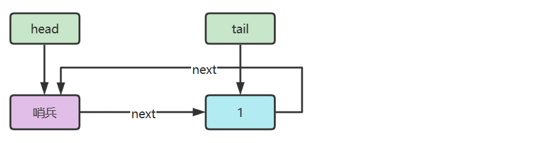

## Queue

> In computer science, a **queue** is a collection of entities that are maintained in a sequence and can be modified by  the addition of entities at one end of the sequence and the removal of  entities from the other end of the sequence

The use case of queue within leetcode's scope lies heavy in breadth first search.

### 2) 链表实现

下面以**单向环形带哨兵**链表方式来实现队列





Here's a simple implementation of Queue using a Singly linked list like structure.
In fact, LinkedList in java implements Queue

```java
public class LinkedListQueue<E> {
    private static class Node<E> {
    E value;
    Node<E> next;

    public Node(E value, Node<E> next) {
        this.value = value;
        this.next = next;
    }
    }

    private Node<E> head = new Node<>(null, null);
    private Node<E> tail = head;
    private int size = 0;
    private int capacity = Integer.MAX_VALUE;

    {
        tail.next = head;
    }
    
    public LinkedListQueue() {}

    public LinkedListQueue(int capacity) {
        this.capacity = capacity;
    }

    public boolean offer(E value) {
        if(isFull()) {
            return false;
        }
        Node<E> newNode = new Node(value, head);
        tail.next = newNode;
        tail = newNode;
        size++;
        return true;
    }

    public E poll() {
        if(isEmpty()) {
            return null;
        }
        Node first = head.next;
        this.head.next = first.next;
        // if there was only one element in the queue, and we just removed it
        if(first == tail) {
            // reset the queue to its empty state
            tail = head;
        }
        return first.value;
    }

    public E peek() {
        if (isEmpty()) {
            return null;
        }
        return head.next.value;
    }

    public boolean isEmpty() {
        return head == tail;
    }

    public boolean isFull() {
        return size == capacity;
    }

    public Iterator<E> iterator() {
        return new Iterator<E>() {
            Node<E> p = head.next;
            @Override
            public boolean hasNext() {
                return p != head;
            }
            @Override
            public E next() {
                E value = p.value;
                p = p.next;
                return value;
            }
        };
    }
}
```